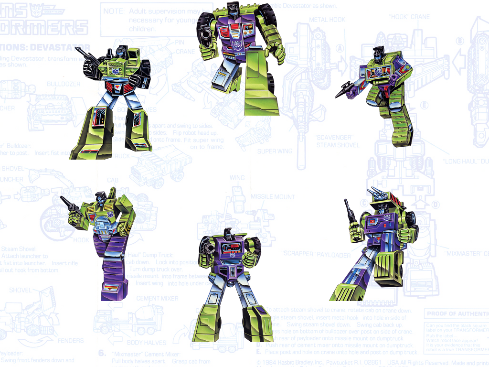
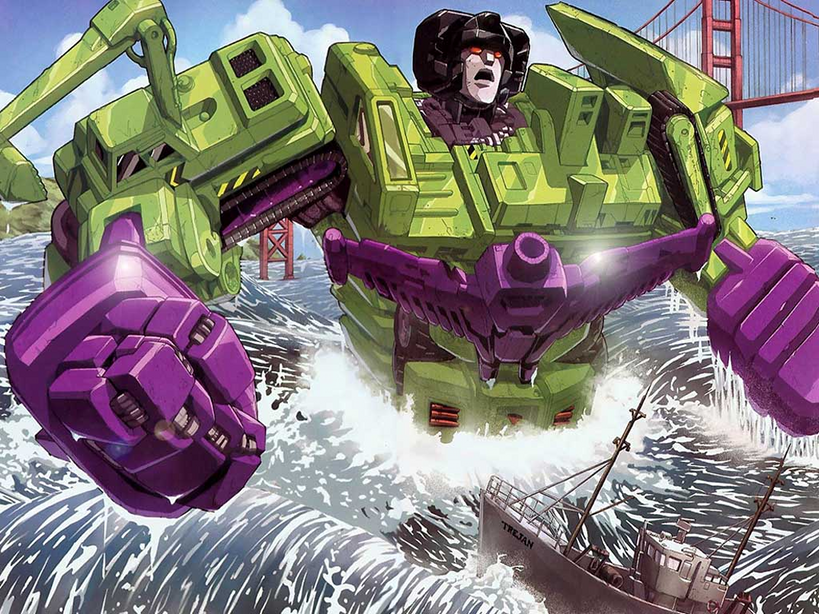

<!SLIDE center>
# Sensu Intro
 
 

## Heavy Water Operations
### #DevOpsDays Vancouver, 2013

<!SLIDE bullets incremental transition=scrollUp>
# What is it?
## An open source monitoring framework.
## Aims to be simple, malleable, and scalable.

* Compose a system - your requirements.

* Don't tie yourself to a single monolithic piece of software or service.

<!SLIDE center transition=growX>

<!SLIDE center transition=fadeZoom>

